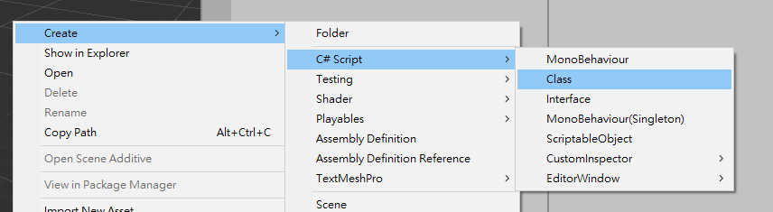

# Unity-ScriptTemplates
There are some script templates and the namespace filler script for Unity.

It is just a backup for personal use and it's a constant work in progress.

---
### Usage

There are two ways to use this repo:

1. Download and put `Assets/ScriptTemplates` folder into `Assets/` and restart Unity Editor.
2. By git submodule:
```
cd <unity_project_root>
git submodule add -b submodule https://github.com/qwe321qwe321qwe321/Unity-ScriptTemplates.git Assets/ScriptTemplates
git submodule update --init
```

### Result



### Namespace Filler

By default, it will fill in a namespace automatically by the path of script that you created.

Examples:
* `Assets/Pedev/Example/Scripts/Foo.cs` -> `Pedev.Example`
* `Assets/Pedev/ExampleEditor/Editor/Foo.cs` -> `Pedev.ExampleEditor`

You can rewrite the namespace rule in `ScriptTemplates/NamespaceFiller.cs`.
